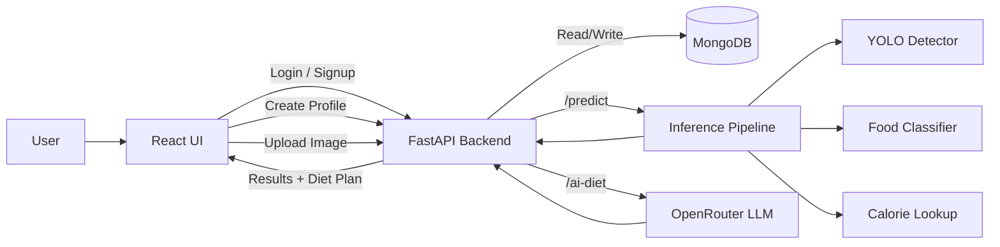

# NutriVision

NutriVision is a full-stack food recognition and calorie estimation app. The backend runs a YOLO detector plus a classifier to identify foods in an image and estimate calories. The frontend provides login, profile setup, image upload, and an AI-generated diet plan based on user goals and consumed calories.

## Features

- Food detection from images using YOLO and a secondary classifier.
- Calorie estimation per detected item with a total calories summary.
- Portion input for items like chapati and bhatura to scale calories.
- User authentication (signup and login) stored in MongoDB.
- Profile management for age, weight, height, goal, and activity.
- AI diet plan generation using OpenRouter (LLM) based on profile and consumed calories.
- React single-page app with upload, results, and diet plan UI.

## Tech Stack

- Backend: FastAPI, PyTorch, Ultralytics YOLO, OpenCV, PIL, MongoDB
- Frontend: React (Create React App), Axios
- AI Diet: OpenRouter chat completion API (default model: Llama 3 8B Instruct)

## Project Structure

- backend/app.py: FastAPI app and API routes
- backend/utils/pipeline.py: YOLO + classifier inference pipeline
- backend/utils/calories.py: calorie lookup table
- backend/utils/gemini.py: diet plan generation via OpenRouter API
- backend/models/: model weights and class mapping
- frontend/src/App.js: main React UI and API calls

## Architecture Diagram



## API Endpoints

- GET /: health check
- POST /signup: create a new user
- POST /login: authenticate a user
- POST /create-profile: save profile details for a user
- POST /predict: upload image and get detected items + calories
- POST /ai-diet/{email}?consumed={total}: diet plan for a user

## Setup

### Prerequisites

- Python 3.9+ and pip
- Node.js 18+ and npm
- MongoDB connection string

### Environment Variables

Create a .env file in backend/ with:

```
MONGO_URI=your_mongodb_connection_string
OPENROUTER_API_KEY=your_openrouter_api_key
```

OPENROUTER_API_KEY is required for AI diet generation. If it is missing or invalid, the backend falls back to a default diet response.

## Run the Backend

From the repo root:

```
cd backend
python -m venv .venv
.venv\Scripts\activate
pip install -r requirements.txt
uvicorn app:app --reload --host 127.0.0.1 --port 8000
```

The API will be available at http://127.0.0.1:8000.

## Run the Frontend

From the repo root:

```
cd frontend
npm install
npm start
```

The UI will be available at http://localhost:3000.

## How It Works

1. User logs in or signs up, then completes their profile.
2. User uploads a food image in the dashboard.
3. The backend runs detection and classification, returns items and calories.
4. The frontend shows detected foods and lets users adjust portions for select items.
5. The backend uses the user profile and consumed calories to generate a diet plan.

## Notes

- The models are loaded once at startup for faster inference.
- The backend uses GPU if available, otherwise CPU.
- Calories are estimated from a fixed lookup table in backend/utils/calories.py.

## Troubleshooting

- If /predict fails, ensure model files exist under backend/models/.
- If login/profile fails, verify MONGO_URI and that MongoDB is reachable.
- If diet plan fails, verify OPENROUTER_API_KEY and internet connectivity.

